# Mamba Fast Tracker

## Overview

Flutter app for the Mamba Fast Tracker technical challenge: intermittent fasting and calorie tracking, Android first, all data stored on the device.

The repository currently has email and password accounts with Firebase Authentication, fasting protocol selection, a timestamp-based fasting timer with local notifications, meal tracking, a daily summary with goal status, a history of previous days, and a weekly fasting chart. Product features are implemented issue by issue.

## Download

- Repository: <https://github.com/matheusmedrado/desafioMamba>
- Signed release APK: <https://github.com/matheusmedrado/desafioMamba/releases/latest>

To run the project, install that APK on an Android phone or emulator (Android 7.0 or newer) and create an account. There is no browser version: the app stores its data on the device with SQLite and sends local notifications, which a web build cannot do.

## Screenshots

| Today, no fast | Today, fasting | Fast complete |
| --- | --- | --- |
| 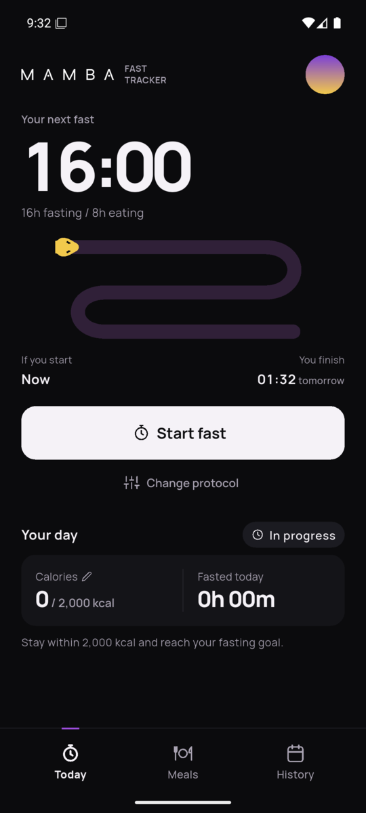 | 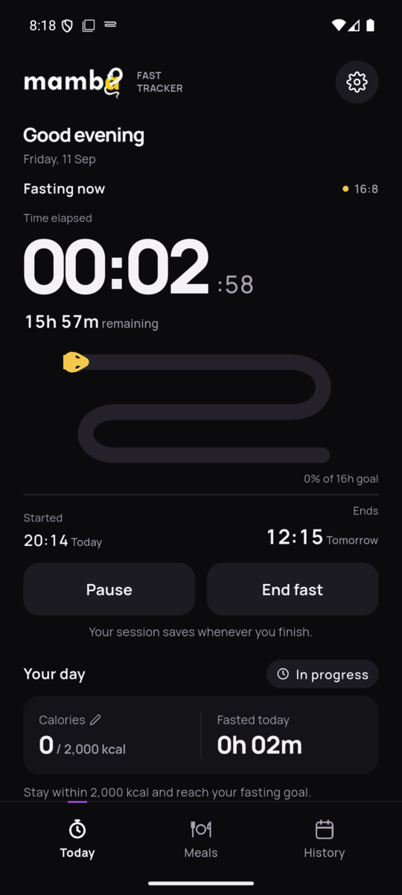 | 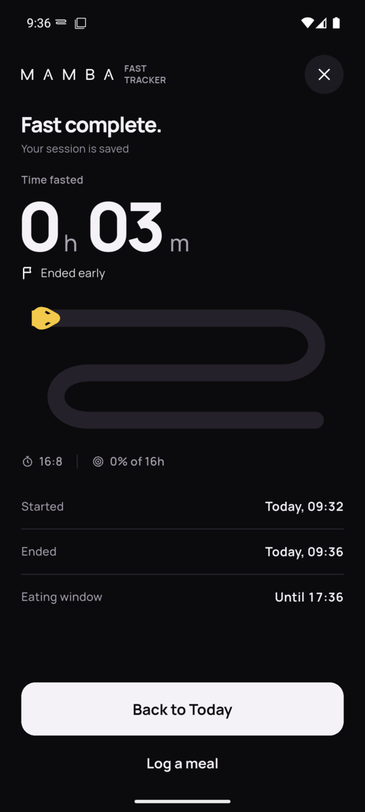 |

| Meals | History | Week |
| --- | --- | --- |
| 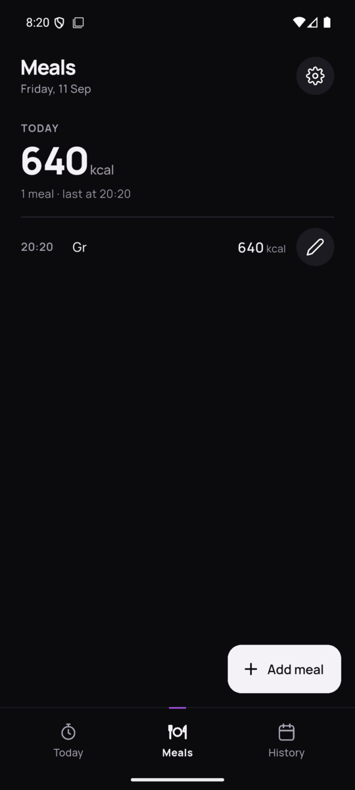 | 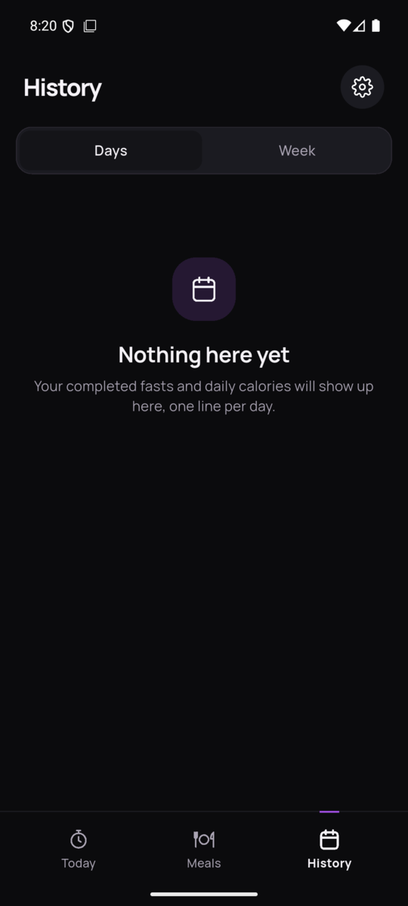 | 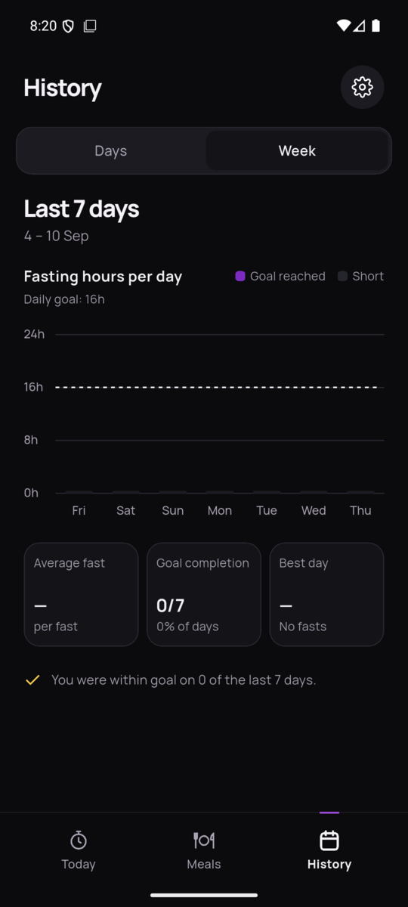 |

| Protocols | End fast | Notification |
| --- | --- | --- |
| 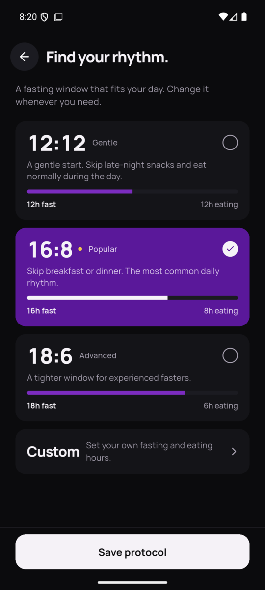 | 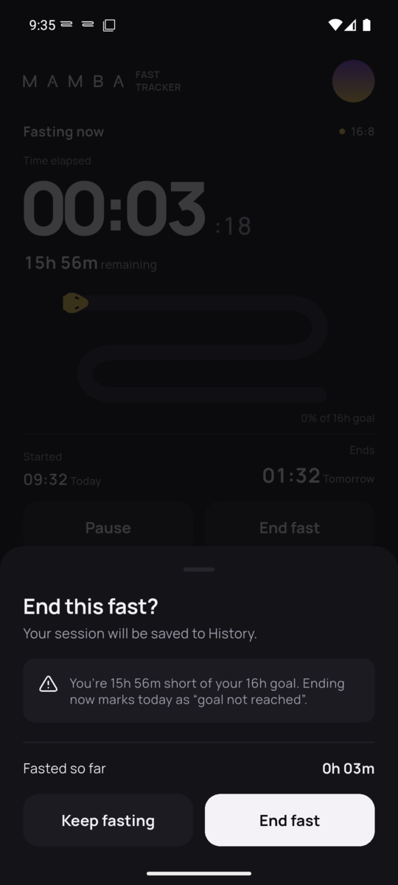 | 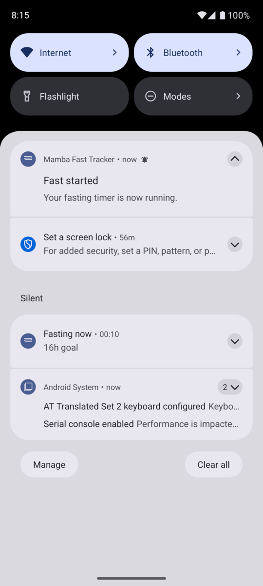 |

| Settings | Login | Login in Portuguese |
| --- | --- | --- |
| 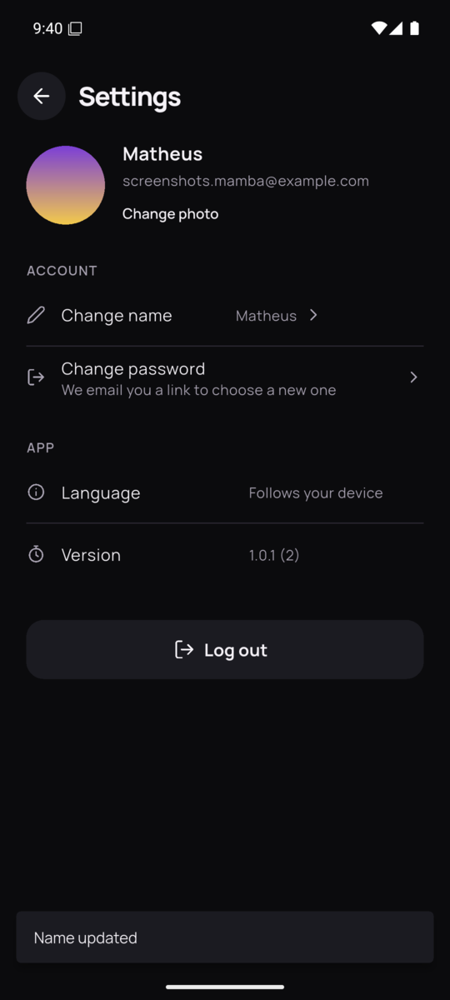 | 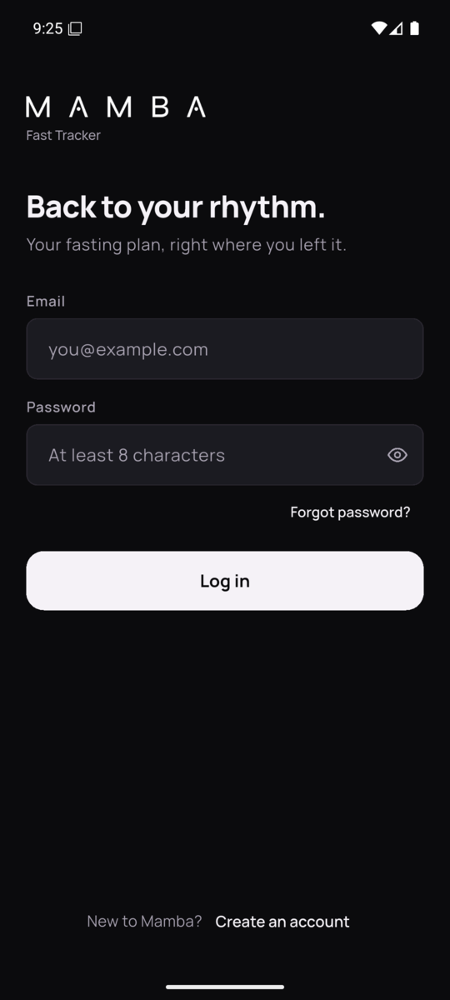 |  |

## Features

Done:

- Accounts with Firebase Authentication: create an account, log in with a checked password, and reset a forgotten password by email. The session is restored after closing and reopening the app, also offline. The settings button shows the signed-in account and logs out. Each account has its own fasts, meals, protocol, and calorie limit on the device.
- Fasting protocols: 12:12, 16:8, 18:6, and a custom protocol with 8 to 23 fasting hours. The choice is stored locally.
- Fasting timer with start, pause, resume, and manual end controls. Elapsed and remaining time are restored from persisted timestamps after backgrounding or restarting the app. Today shows the fast on a winding fasting route. Ending a fast asks for confirmation, warns when the goal is not reached yet, and then shows a Fast complete summary with the time fasted and the eating window.
- Local notifications when a fast starts and when its planned fasting goal is reached. The scheduled notification is restored, rescheduled, or canceled with the active session.
- An ongoing notification counts the fasting time while the app is closed, and shows the frozen time while the fast is paused.
- English and Portuguese. The app follows the language of the device, including dates and numbers.
- Settings with a profile photo kept on the device, the account name, a password reset link, the language, the app version, and log out. The photo replaces the settings button in the header.
- Meal tracking: add, edit, and delete today's meals with a name and calories. The meal time is recorded automatically, and meals are stored in SQLite so they remain after restarting the app.
- Daily summary on Today: calories against a daily calorie limit, fasting time for the day, and whether the day is within goal. Ended fasts are stored in SQLite, so the totals remain after restarting the app.
- History: previous days with records, newest first, grouped into this week, last week, and earlier. Each day opens a read-only summary with its fasts, meals, and goal status.
- Weekly chart: fasting hours for each of the last seven complete days against the fasting goal, with the average fast, the number of days within goal, and the best day.

UI polish and release preparation are tracked in [GitHub Issues](https://github.com/matheusmedrado/desafioMamba/issues).

## Tech Stack

- Flutter 3.47.2 with Dart 3.13.2
- `flutter_riverpod` for state management and dependency injection
- `firebase_core` and `firebase_auth` for email and password accounts
- `shared_preferences` for small single-record data such as the active fast and the calorie limit
- `sqflite` for meals and ended fasts, with `path` to build the database file path
- `flutter_local_notifications` for Android start and fasting-goal notifications
- `timezone` and `flutter_timezone` for scheduling in the device's local timezone
- `flutter_svg` to draw the app's stroke icons from SVG paths
- `flutter_localizations` and `intl` for English and Portuguese, and for localized dates and numbers
- `flutter_launcher_icons` to generate the Android launcher icons from one image
- `image_picker`, `path_provider`, and `package_info_plus` for the profile photo and the app version
- Manrope (SIL Open Font License) bundled as the app font
- `flutter_test` and `flutter_lints`
- `sqflite_common_ffi` so repository tests run against real SQLite on the development machine and in CI
- Java 17, Android platform 36, Gradle from the generated Android project
- GitHub Actions for validation

## Architecture

Feature-first layout with a small shared core. Each feature keeps its own `domain`, `data`, and `presentation` code, and only creates the folders it needs.

Responsibilities:

- `domain`: plain Dart models and calculations. No Flutter imports. This is where fasting time math and the daily goal rule live, so they can be unit tested with a fake clock.
- `data`: repositories that own persistence for one kind of data.
- `presentation`: Riverpod notifiers that act as view models, plus widgets that render state and forward user actions.

Rules the code follows:

- Persisted timestamps are the source of truth for the fasting timer. A periodic timer only refreshes the UI. Elapsed and remaining time are always computed from stored values plus the current clock, so the timer stays correct after backgrounding and after the process is killed.
- Each durable piece of data has one repository that owns it.
- Repositories are built for the signed-in account. Rows carry a user id, single records use a key per user, and every query filters by the current user, so two accounts on one device never see each other's data.
- The current time comes from an injected `Clock`, never from `DateTime.now()` inside business logic.
- Screen text comes from ARB files. Domain rules return codes, such as `AuthFailure.invalidCredentials` or `MealFieldError.nameTooLong`, and the screen turns them into a message, so no layer below the UI holds English text.
- Navigation uses the plain `Navigator` with a bottom navigation shell. No routing package. A tab is built the first time it is opened and then kept in an `IndexedStack`, so switching tabs does not reload it.
- The fasting screen observes app lifecycle changes. It stops the display ticker when hidden and reloads the persisted session when the app resumes.
- Notifications are a projection of the persisted fasting session. A fixed goal-notification ID is canceled before a new target is scheduled, so pause, resume, end, and restore cannot leave an old target behind.
- Android uses inexact alarms. The timer remains correct if Android delays or does not deliver a notification.
- A fast is copied to SQLite when it ends. The copy is keyed by the fast id and repeated whenever the current fast loads, so it also recovers an app closed between the two writes.
- The daily summary is calculated in plain Dart from today's meals, the fasts that ended today, the current fast, and the calorie limit. It recalculates on every timer tick, so a running fast's time stays current.
- History uses the same daily goal rule as Today. It groups earlier meals and ended fasts by local day in plain Dart, and each day is summarized with `DaySummary`. The weekly summary is built from those same days.
- The fasting route on Today is drawn with `CustomPainter`. Its progress comes from the same persisted session as the timer.

## Project Structure

```text
.github/
  ISSUE_TEMPLATE/       Task template
  workflows/            Flutter validation
  pull_request_template.md
android/                Android host and Gradle configuration
assets/
  fonts/                Manrope and its license
  icon/                 Launcher and notification icon sources
  images/               Wordmark
docs/
  screenshots/          Screens captured from the release build
lib/
  main.dart             Composition root: Firebase setup, ProviderScope, and app
  firebase_options.dart Firebase configuration generated by FlutterFire
  app/                  MaterialApp, theme, auth gate, tab shell, brand and screen headers, and icons
  l10n/                 English and Portuguese texts, and the generated localizations
  core/                 Clock, SQLite database, preference keys per user, local day boundaries, and formatting helpers
  features/
    auth/
      domain/           AuthUser, AuthFailure messages, login form rules
      data/             AuthRepository interface and its Firebase implementation
      presentation/     AuthController, LoginScreen with account creation, password reset sheet, settings screen, profile button
    fasting/
      domain/           FastingProtocol, ProtocolSettings, FastingSession
      data/             ProtocolRepository, FastingRepository, CompletedFastRepository, and notification service
      presentation/     Riverpod controllers, Today screen with the fasting route, end fast sheet, Fast complete screen, protocol selection and custom editor
    meals/
      domain/           Meal model, calorie total, meal form rules
      data/             MealRepository over sqflite
      presentation/     MealsController, Meals screen, add/edit and delete sheets
    dashboard/
      domain/           DaySummary goal rule, calorie limit rules
      data/             CalorieLimitRepository over shared_preferences
      presentation/     Today summary providers, Your day section, calorie limit sheet
    history/
      domain/           HistoryDay grouping by local day, WeekSummary
      presentation/     HistoryController, History screen with Days and Week views, day summary screen, weekly chart
test/
  app/                  App smoke test and icons
  core/                 Clock, database upgrade, local day, and formatting tests
  features/auth/        Validator, error mapping, controller, login, account creation, password reset, and logout tests
  features/fasting/     Protocol, timer, eating window, persistence, completed fasts, notification, controller, fasting route, fasting window bar, Today end flow, and selection flow tests
  features/meals/       Validator, SQLite repository, controller, and Meals screen tests
  features/dashboard/   Goal rule, calorie limit, summary provider, and Your day section tests
  features/history/     Day grouping, week summary, controller, History screen, and Week view tests
pubspec.yaml            Package metadata and dependencies
pubspec.lock            Resolved dependency versions
```

## Getting Started

Install Flutter 3.47.2 from the [Flutter SDK archive](https://docs.flutter.dev/install/archive) and add its `bin` directory to your `PATH`. Dart is included.

Set up Java 17 and the Android SDK using the [Android setup guide](https://docs.flutter.dev/platform-integration/android/setup). The generated project uses Android platform 36. Gradle may download missing SDK and NDK components during the first build. Accept the Android SDK licenses on your development machine.

```bash
git clone https://github.com/matheusmedrado/desafioMamba.git
cd desafioMamba
flutter doctor -v
flutter doctor --android-licenses
flutter pub get
```

If Flutter selects a different Java installation, point it at your Java 17 installation with `flutter config --jdk-dir=<path-to-jdk-17>`.

The Firebase configuration for Android (`android/app/google-services.json` and `lib/firebase_options.dart`) is committed, so the app builds and accounts work without extra setup. To use your own Firebase project instead, enable Email/Password sign-in in Firebase Authentication and run `flutterfire configure`.

## Running the App

Connect an Android device with USB debugging enabled or start an Android emulator.

```bash
flutter devices
flutter run -d <device-id>
```

The app opens on the login screen. Tap Create an account, enter an email and a password with at least 8 characters, and the app signs you in. Later you log in with the same password, or use Forgot password to get a reset email. Creating an account and logging in need an internet connection. After that the Today tab shows the next fast or the running fast on the fasting route, with start, pause, resume, and end controls (ending asks for confirmation first), and a summary of the day with calories, fasting time, and goal status. Tap Calories in that summary to change the daily calorie limit, and use the settings button to log out. The Meals tab lists today's meals and adds, edits, or deletes them. The History tab lists previous days in the Days view and shows the weekly fasting chart in the Week view. Android 13 and newer ask for notification permission when the first fast starts.

## Building the APK

```bash
flutter build apk --release
```

Output: `build/app/outputs/flutter-apk/app-release.apk`.

### With Docker

The `Dockerfile` builds the same APK without a local Flutter, Java, or Android SDK setup. It pins Flutter 3.47.2, Android platform 36, build-tools 36.0.0, and the NDK the project uses, so the result matches CI.

```bash
docker build --target apk --output type=local,dest=build/docker .
```

Output: `build/docker/app-release.apk`.

The first build downloads the toolchain and takes several minutes. Later builds reuse the cached toolchain layers and a Gradle cache mount, so only the app compiles again. Docker is only a build environment here. Running the app still needs an Android device or emulator.

### Signing

Release builds are signed with a keystore that stays outside the repository. Gradle reads `android/key.properties`, which is git-ignored:

```properties
storePassword=<password>
keyPassword=<password>
keyAlias=mamba
storeFile=/absolute/path/to/mamba-release.jks
```

Create your own keystore with:

```bash
keytool -genkeypair -v -keystore ~/.android/mamba-release.jks -storetype JKS \
  -keyalg RSA -keysize 2048 -validity 10000 -alias mamba
```

Without `key.properties`, as on CI and in the Docker build, the release build falls back to the debug key so it still compiles. An APK signed with the release key cannot be installed over one signed with the debug key, so uninstall the old build first.

## Testing

```bash
flutter pub get
dart format --output=none --set-exit-if-changed lib test
flutter analyze
flutter test
```

Tests live in `test/` and mirror the `lib/` layout. Time based rules run against a `FakeClock` and fixed UTC dates, and SQLite tests use `sqflite_common_ffi` with an in-memory database, so every run is deterministic.

GitHub Actions runs these checks and `flutter build apk --release` on pull requests into `main` and pushes to `main`.

### What the tests cover

| Area | Behavior tested |
| --- | --- |
| Fasting session | Elapsed and remaining time while running, paused, and ended. A pause freezes elapsed time, several pauses add up, and resume moves the target end. Ending before or after the target, reaching the target without ending, and a device clock set before the start. Invalid transitions and inconsistent stored data are rejected. JSON round trips for every status. |
| Restore | A new provider container stands in for a killed process. A running fast restores with the correct elapsed time, a paused fast stays frozen, a fast whose target passed while the app was closed stays running with the goal reached, and an ended fast that was not copied to SQLite is copied once. A storage failure on restore shows an error, and a malformed stored session is removed. |
| Notifications | The goal notification is scheduled, rescheduled, or canceled from the saved session after each transition and on restore. The ongoing notification counts from the start plus the paused time, freezes while paused, and disappears when the fast ends. Notification failures do not block the timer. |
| Language | A device in Portuguese sees the app in Portuguese, and any other language falls back to English. |
| Profile | Settings shows the account, the language, and the version. Saving a name updates the profile. The chosen photo is copied into the app's files and survives the original being deleted, each account keeps its own, and removing it deletes the file. |
| Daily totals | Calories count only meals on the local day, and the limit itself is within goal. Fasting time counts on the day a fast ends, without paused time, and each fast is compared with its own target. The running fast adds to today. Totals match the stored data after a restart. |
| History and week | Grouping by local day, today left out, this week and last week groups, the weekly summary, and past statuses after a limit change. |
| Accounts | Creating an account, logging in, a wrong password, matching passwords on sign up, password reset, logging out, and the session after a restart, using an in-memory auth repository. Firebase error codes map to messages, and an unknown email and a wrong password show the same one. Logging out cancels the fasting notifications. |
| Data per account | Two accounts on one device keep separate meals, fasts, protocol, and calorie limit. One account cannot change or delete another account's meal. Data saved before accounts existed goes to the first account that signs in, in SQLite and in the stored records. |
| Persistence | Round trips and restarts for the active fast, protocol, calorie limit, meals, and completed fasts, including corrupted records. |
| Screens | Widget tests for logging in, creating an account, password reset, and logging out, the Today timer (ticker, return from background, end sheet, Fast complete), protocol selection, meals, the daily summary, History, and the Week view. |

### Remaining gaps

- Process death is simulated with a new provider container, not by killing the Android process. Real restarts were checked by hand on an emulator.
- Tests never call Firebase. The Firebase implementation of `AuthRepository` was checked by hand on an emulator.
- Notification delivery by Android is not tested. The tests use a fake service and check only what is scheduled or canceled.
- A device clock that jumps is not detected. Elapsed time follows the new clock, and a clock set before the start counts as zero.
- There are no integration or golden tests, so layout is checked on an emulator. Widget tests use the default test font, which is wider than Manrope.

## Engineering Decisions

### State management: Riverpod

Problem: the app needs shared state (session, active fast, meals) that several screens read, and business logic that tests can drive without widgets.

Decision: `flutter_riverpod` without code generation. Notifiers act as view models. Repositories and the clock are providers.

Reason: providers double as dependency injection, so tests override the clock and repositories with fakes in one place. There is little boilerplate compared to Bloc, and the pattern is easy to explain.

Trade-off: Riverpod is one more concept than `ChangeNotifier` with `provider`. The gain in testability is worth it for the timer logic.

### Persistence: shared_preferences plus sqflite

Problem: some data is a single record (selected protocol, active fast, calorie limit), some data is a growing list queried by day (meals, completed fasts).

Decision: `shared_preferences` for single records stored as JSON, `sqflite` tables for meals and completed fasting sessions.

Reason: key-value storage is the simplest fit for single records. SQLite makes daily totals and the weekly chart plain queries instead of in-memory filtering over JSON blobs. Neither needs code generation.

Trade-off: two storage packages instead of one. Each repository owns exactly one of them, so the split stays clear.

Data belongs to one account. The `meals` and `fasting_sessions` tables have a `user_id` column (database version 3), and the active fast, protocol, and calorie limit are stored under a key that ends with the user id. Data saved before accounts existed has no owner, and the first account that signs in on the device takes it over, so nothing is lost when the app is updated. Logging out keeps the data and cancels that account's fasting notifications.

Alternative considered: `drift` for typed SQL. Rejected because generated files add explanation and setup cost that this scope does not need.

### Authentication: Firebase Auth

Problem: the first version accepted any password that passed the form rules, so it was not a real account system. The challenge asks for email and password login with a persistent session.

Decision: Firebase Authentication with email and password. The login screen switches between logging in and creating an account, and Forgot password sends a reset email. `AuthRepository` is a small interface with a Firebase implementation. `AuthController` follows its auth state stream, and `AuthGate` picks the login screen or the app from that value. Firebase error codes become `AuthFailure` values with messages the user can act on, and an unknown email and a wrong password show the same message.

Reason: Firebase checks and stores passwords securely and sends reset emails without a backend of our own. It keeps the session on the device, so the app opens signed in after a restart, also offline. The interface keeps Firebase out of the tests, which use an in-memory fake.

Trade-off: creating an account, logging in, and resetting a password need a connection, and the app depends on a Firebase project. Fasts, meals, and settings still stay on the device and are not synced. Local accounts with hashed passwords were considered, but they would work offline and still could not reset a forgotten password.

### Fasting timer model

Problem: an in-memory counter drifts when Android suspends the app and is lost when the process is killed.

Decision: persist the protocol id, target duration, `startedAt`, `pausedAt`, accumulated paused time, `endedAt`, and lifecycle status. Compute elapsed and remaining from those values and the clock on every refresh.

Reason: the same calculation works while the app is open, after returning from background, and after a cold start. Paused wall-clock time is excluded. Reaching the target does not end the session on its own. The UI shows the goal as reached and the user ends the fast.

Trade-off: a few more fields than a counter. In exchange the timer has no drift and needs no background service.

### Local notifications

Problem: a notification must follow the active fasting session across pause, resume, restart, and manual end without becoming a second source of truth.

Decision: use `flutter_local_notifications` with `timezone`. Show a start notification immediately, and schedule one fixed-ID notification for the planned fasting goal. Synchronization cancels that ID first, then schedules it only for a running session whose goal has not been reached.

Reason: the persisted session already contains the target timestamp inputs. Rebuilding the notification projection from that state keeps pause, resume, end, and restore idempotent. `flutter_timezone` sets the timezone used by the schedule while persisted timestamps remain UTC.

Trade-off: Android uses inexact alarms, so delivery can be delayed by the OS. Notification timing is only a reminder; timer calculations do not depend on it. A failed notification call is logged and skipped, so it cannot block loading or changing a fast. The next transition or restore synchronizes again.

### Meal tracking

Problem: meals are a growing list that later issues will total per day and per week, and the challenge asks for an automatic meal time.

Decision: one `meals` table in a single app database (`core/database.dart`), with the meal time stored as UTC epoch milliseconds and indexed. The time is set once when the meal is added. Editing changes only the name and calories. The Meals screen shows the local calendar day of the injected clock and reloads when the app returns to the foreground, so the list moves to the new day after midnight. Every add, edit, or delete is saved first and the list is then read back from the database.

Reason: storing UTC and filtering by local day boundaries keeps day totals correct across timezones and daylight saving changes. Reading back after each change means the screen always shows what is stored. Keeping every table in one database file gives the schema one version number for future migrations.

Trade-off: re-reading the day after each change is an extra query, which is negligible for one day of meals. The meal time cannot be corrected by hand, which matches the specification but means a meal logged late keeps the time it was logged.

### Daily goal and day boundaries

Problem: the specification asks whether the user is within the goal, but it does not define the goal or which day a fast belongs to.

Decision: a day is within goal when its calories are at or under a daily calorie limit and a fast credited to that day reached its own target. The limit is 2,000 kcal by default and can be set from 500 to 5,000 on Today. A fast is credited to the local calendar day it ends, and the fast that has not ended counts toward today. Today reads "In progress" until the result is known. It becomes "Outside" as soon as calories go over the limit, or when the day's fast ended short of its target and no fast is still open. Ended fasts are copied to a `fasting_sessions` table (database version 2), so starting a new fast no longer replaces the previous one.

Reason: every fast already has a target, so judging a day by whether a fast reached it needs no new setting. The calorie limit adds the calorie side of the goal. Crediting a fast to the day it ends is exact with the stored fields, and a fast that starts in the evening naturally belongs to the next day. Each fast is compared with its own target, so changing the protocol later does not change past results.

Trade-off: a fast that crosses midnight adds no time to the day it started. Splitting fasting time at midnight was considered, but it would need the start and end of every pause, and only the total paused time is stored. The calorie limit is one current value rather than a value saved per day.

### History

Problem: previous days must be reviewable from the saved records, with summaries that match those records.

Decision: History lists every day before today that has at least one meal or ended fast, newest first. The meals and fasts before today are read once from their repositories and grouped by local day in plain Dart, and each day is summarized with the same `DaySummary` rule as Today. The day screen is read-only. The list reloads when the app returns to the foreground or the calorie limit changes.

Reason: reusing `DaySummary` keeps History and Today consistent by construction. Grouping in Dart uses the same local day boundaries as the daily queries, which avoids timezone handling inside SQL.

Trade-off: all earlier records are loaded at once. That is small for a personal tracker, but a long history would need paging or a date range. Days with no records are not shown, and past meals cannot be edited.

### Weekly chart

Problem: the challenge asks for a simple weekly chart of calories or fasting time, and the chart dependency had to be chosen.

Decision: the Week view in History charts fasting hours for the seven complete days before today, built from standard widgets (`Row`, `Stack`, and sized `Container` bars) with no chart package. Each bar is colored by whether a fast that day reached its own target. A dashed line marks the goal of the currently selected protocol. The "days within goal" count uses the full daily goal from `DaySummary`, and the average is per fast. The Days view shows the same count and average at the top.

Reason: fasting time is the app's main metric. Seven fixed bars need only proportional heights, so a chart package or custom painting would add code and a dependency without a real benefit. `WeekSummary` is built from the History days, so the chart and the list always agree.

Trade-off: no touch interaction, animation, or other time ranges. The goal line uses the current protocol, while bar colors use the target of each day's fasts, so after a protocol change the two can differ.

### UI polish

Problem: once the core behavior was reasonably stable (timer, persistence, meals, daily summary, and history), the interface still used generic layouts and had little personality.

Decision: start a polish pass on the interface, beginning with the navigation and the Today screen. Today now leads with a large timer and a winding fasting route drawn with `CustomPainter`, where a small yellow head follows the route as the fast progresses. Icons are drawn with `flutter_svg` from SVG paths so they keep the same stroke style everywhere. The navigation marks the active tab with a thin purple bar instead of a pill, and logout moved into a settings sheet opened from the header.

Ending a fast now goes through a confirmation sheet. It warns only when the fast is short of its goal, since ending then marks the day as not reached. The end is saved before the Fast complete screen opens, so closing that screen or the app cannot lose it. The screen shows the time fasted, the route, the start and end, and the eating window, which is the rest of 24 hours after the fast ends (a 16-hour fast leaves 8 hours). Its Log a meal button switches to the Meals tab through a small inherited widget from the tab shell, so no routing package is needed.

The last step carried the same look to Meals, History, the day summary, the Week view, protocol selection, and login. Meals and History share a screen header with the settings button, pushed screens use a round back button, and these screens now use the same stroke icons as Today. The Add meal button is off-white like the other primary actions. Protocol presets keep their fasting window bar, while Custom became a compact row that opens the editor. The bar itself had zero height before, because its colored parts were not stretched, so it now has a widget test. On the Week view, the legend wraps on narrow screens, the stat card titles take the same height so the values line up, and the yellow brand accent marks the written summary. Behavior did not change, so the existing screen tests still cover these screens.

Reason: behavior came first, so the polish could build on screens and states that already worked and were tested. The route and the icons give the app a recognizable look, and drawing them from fixed geometry keeps them consistent at every size. `flutter_svg` covers SVG rendering, which Flutter does not provide.

Trade-off: one more package, and the Today screen has more custom layout to maintain. The timer logic did not change: the route and the numbers still come from the persisted session and the clock.

### Showing the fast outside the app

Problem: the timer is the core of the app, but nothing proved it was running once the app was closed. The only sign was the goal notification, hours later.

Decision: while a fast is running, an ongoing notification shows the elapsed time with Android's chronometer, counting from the start plus the paused time. Pausing replaces it with the frozen time, and ending or logging out removes it. It uses its own low-importance channel so it never makes a sound, and it is rebuilt from the saved session by the same synchronization as the goal notification.

Reason: Android updates the chronometer itself, so the time stays correct with no background service, no wake locks, and no battery cost. The session stays the only source of truth.

Trade-off: it needs the notification permission, and Android 14 and newer let the user dismiss ongoing notifications. The timer does not depend on it either way.

### App icon and release signing

Problem: the app shipped with the default Flutter icon and a debug signature, which is not a build ready for distribution.

Decision: the icon is the fasting route from the app, drawn as SVG and rendered into the launcher icon, the adaptive icon, and a white notification icon. `flutter_launcher_icons` generates the Android sizes. Release builds are signed with a keystore outside the repository, read from `android/key.properties`, and fall back to the debug key when that file is missing.

Reason: reusing the route ties the icon to what the app looks like, and keeping the keystore out of the repository means the signing key is not published with the code while CI can still build.

Trade-off: whoever clones the project gets debug-signed builds until they create a keystore. The release build also strips resources that only Dart names, so the notification icon is kept explicitly in `res/raw/keep.xml`.

### Two languages

Problem: the interface was English only, and the app is for a Brazilian product.

Decision: English and Portuguese with `flutter_localizations` and ARB files. The app follows the language of the device and falls back to English. `Intl.defaultLocale` is set from the resolved locale, so dates and numbers follow the same language. Domain rules return codes instead of text, and the screens turn them into messages. Notifications, which have no screen, read the device language directly.

Reason: ARB with the Flutter tooling needs no extra package, and keeping text out of the domain means adding a language does not touch business rules.

Trade-off: every screen depends on the localizations, and a third language means translating one more file by hand. There is no language switch inside the app.

### Other choices

- The protocol choice is one small record: the selected protocol id plus the custom fasting hours. Custom hours are kept when a preset is selected again, so the custom card stays editable. Presets are constants in code, since they never change and there is nothing to store for them.
- Plain `Navigator` instead of a routing package. A few tabs and a handful of pushed screens do not justify one.
- The wordmark in the header and on login is the Mamba Growth logo, drawn white for the dark background. It is a single image asset, so replacing it did not touch any code.
- Manrope is bundled as an asset instead of fetched at runtime, so the app renders correctly offline and on first launch.
- The Dockerfile installs the toolchain from the official Flutter and Android archives instead of a community image, so the Flutter version can be pinned to exactly what CI uses.
- Android is the only generated platform because the challenge requires an APK or AAB.
- CI pins Flutter 3.47.2, and the lockfile is committed to keep dependency resolution repeatable.

## Trade-offs

- Local persistence only. Reinstalling the app clears all data. This matches the challenge scope, which does not ask for cloud sync.
- The theme is dark only. A light theme is possible later since the color tokens exist for it.
- The release APK is signed with a key that is not in the repository, so anyone who clones the project builds with the debug key unless they create their own keystore.

## Known Limitations

- Creating an account, logging in, and password reset need an internet connection. Email addresses are not verified.
- Android may delay inexact notifications because of Doze mode or vendor battery-management rules. Notification permission can also be denied.
- Meals from earlier days are read-only. They can be reviewed in History but not edited.
- A fast counts on the day it ends. A fast that crosses midnight adds no time to the day it started.
- The calorie limit is a single current value. Earlier days in History are judged against the current limit.
- If saving an ended fast to SQLite fails, the error is logged and the copy is retried the next time the current fast loads. If it still fails when a new fast starts, that ended fast is missing from the day totals and History.
- History loads all earlier records at once and does not page.
- If the app stays in the foreground past midnight, History and the daily summary update the next time the app returns to the foreground.
- The weekly chart covers only the last seven complete days. Its goal line follows the current protocol.
- The Fast complete screen is shown only right after ending a fast. Reopening the app later goes back to Today, and the fast is reviewed in History.
- The ongoing notification needs the notification permission. If it is denied, the timer still works, but nothing shows outside the app.
- Force-stopping the app from Android settings removes the ongoing notification until the app is opened again. Swiping the app away keeps it.
- The app follows the language of the device. There is no language switch inside the app, and only English and Portuguese are translated.
- The profile photo stays on the device. Reinstalling the app, or logging in on another phone, does not bring it back. Only the name travels with the account.
- The app was checked on an Android 16 emulator (Pixel 7 profile), not on physical phones.

## What I Would Improve With More Time

- Edit past days. Meals and fasts before today are read-only, so a forgotten meal cannot be added later.
- Split a fast that crosses midnight between the two days, which needs the start and end of every pause instead of only the total.
- Keep the calorie limit per day, so changing it today does not rejudge the past.
- Exact goal notifications, with the permission request and the fallback that Android requires, so "you can eat now" is not delayed by battery saving.
- Sync between devices. Accounts already exist in Firebase, so the data could follow the account instead of staying on one phone.
- Integration tests on a real device for the lifecycle cases that are simulated today, and golden tests for the screens.
- Page History instead of loading every record, and refresh it at midnight while the app is open.
- Analytics and crash reporting, which the Firebase project already supports.

## Time Spent

About 24 hours across four days. The hours come from the commit history, so they cover the time between the first and last commit of each day.

| Day | Hours | What was done |
| --- | --- | --- |
| Day 1 | ~10h | Project setup, architecture, CI, Docker build, login with a local session, and fasting protocols |
| Day 2 | ~4h | Fasting timer with persisted timestamps, lifecycle handling, and local notifications |
| Day 3 | ~9h | Meals, daily summary, History, weekly chart, UI polish, more tests, Firebase accounts, data per account, ongoing notification, icon, signing, and this README |
| Day 4 | ~1h | Replaced the wordmark with the Mamba Growth logo, retook the affected screenshots, and released 1.0.1 |
